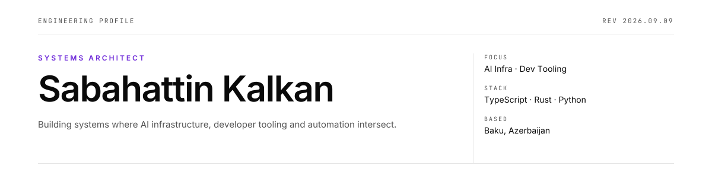

<picture>
  <source media="(prefers-color-scheme: dark)" srcset="assets/hero-dark.svg">
  
</picture>

<picture>
  <source media="(prefers-color-scheme: dark)" srcset="assets/stat-strip-dark.svg">
  
</picture>

## Mission

I build software to make engineering work more honest — systems that do what they claim, tools that remove friction instead of adding it, and infrastructure that holds up once the demo is over.

---

## Selected Projects

### LLM Gateway

A unified OpenAI-compatible gateway for multiple language model providers — one consistent interface across OpenAI, Anthropic, Gemini, Groq, Ollama and others.

**Repository:** https://github.com/sabahattink/llm-gateway

### CodeDiag

Diagnose your code before you ship. One command, five analyzers, one score.

**Repository:** https://github.com/sabahattink/codediag

### Antigravity Fullstack HQ

A permission-first CLAUDE.md + agent stack for Claude Code and Google Antigravity — 10 agents, 28 skills, one-command install.

**Repository:** https://github.com/sabahattink/antigravity-fullstack-hq

### vault-os

Personal knowledge management automation: a Telegram bot, a nightly agent, Whisper transcription, and Obsidian daily notes — running in production against my own daily workflow.

**Repository:** https://github.com/sabahattink/vault-os

### MailTest

A developer-focused email deliverability platform — diagnoses authentication, DNS configuration and inbox placement issues before they affect real users.

### KalkanOS

*Coming soon.*

---

## Engineering Principles

- Solve real problems before polishing ideas.
- Build systems instead of isolated features.
- Prefer maintainability over cleverness.
- Automate repetitive engineering work.
- Document decisions.
- Ship production-ready software.

### Engineering Utilities

*Smaller tools, shipped and maintained the same way.*

| Tool | Description | Tool | Description |
|---|---|---|---|
| [`safe-json`](https://github.com/sabahattink/safe-json) | Safe JSON parse/stringify | [`retry-fn`](https://github.com/sabahattink/retry-fn) | Async retry, backoff |
| [`kill-port`](https://github.com/sabahattink/kill-port) | Kill port process | [`git-whoami`](https://github.com/sabahattink/git-whoami) | Git identity check |
| [`slug-gen`](https://github.com/sabahattink/slug-gen) | Unicode slug generator | [`ai-commit`](https://github.com/sabahattink/ai-commit) | AI commit messages |
| [`dotenv-guard`](https://github.com/sabahattink/dotenv-guard) | Prevent env leaks | [`port-finder`](https://github.com/sabahattink/port-finder) | Find available port |
| [`ghx`](https://github.com/sabahattink/ghx) | Missing GitHub CLI | [`ms-convert`](https://github.com/sabahattink/ms-convert) | Time ⇄ milliseconds |
| [`cron-explain`](https://github.com/sabahattink/cron-explain) | Explain cron expressions | [`license-gen`](https://github.com/sabahattink/license-gen) | Generate LICENSE files |
| [`json-diff-cli`](https://github.com/sabahattink/json-diff-cli) | JSON diff viewer | [`readme-forge`](https://github.com/sabahattink/readme-forge) | AI README generator |

## How I Build Software

Most of what I ship starts as an internal tool solving a problem I actually have. It gets used in production, kept only if it earns its place, then documented and released once it's proven — not before.

<picture>
  <source media="(prefers-color-scheme: dark)" srcset="assets/divider-dark.svg">
  
</picture>

## Tech Stack

**Languages:** TypeScript · Rust · Python · Shell
**Backend:** NestJS · Node.js · PostgreSQL · Redis · Prisma
**Frontend:** React · Next.js · Tailwind CSS
**Infrastructure:** Docker · Linux · GitHub Actions
**AI:** Claude Code · Anthropic · OpenAI · Ollama

---

## Current Focus

- AI Infrastructure
- Agent Engineering
- Developer Tooling
- Systems Architecture
- Automation
- Open Source

---

## Open Source

I believe open source should be practical. I don't publish projects to grow a portfolio — I publish software that has already solved problems in production and can be useful to other engineers. Quality, documentation and long-term maintenance matter more than repository count.

---

## Closing

Software is a way of thinking made executable. I'd rather ship one system that holds up than ten demos that don't.
